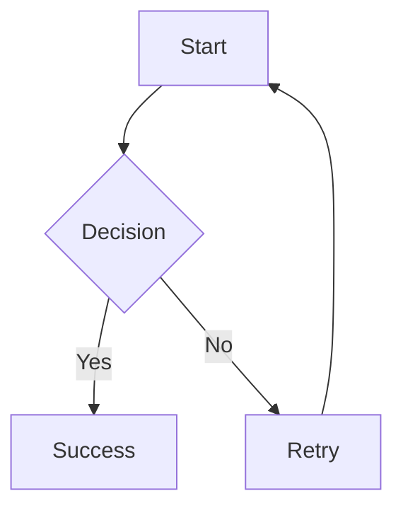

# CLAUDE.md

This file provides guidance to Claude Code (claude.ai/code) when working with code in this repository.

## ⚠️ ABSOLUTE FIRST PRIORITY - MUST FOLLOW BEFORE ALL OTHER RULES ⚠️

### 🚨 PARALLEL TOOL EXECUTION LIMIT 🚨

**MANDATORY RULE**: Execute a **MAXIMUM OF 2 TOOLS IN PARALLEL** at any time.

**This rule MUST be followed as the FIRST PRIORITY** to prevent resource consumption.

- ✅ **ALLOWED**: Running 2 independent tools in a single message (e.g., `git status` and `git diff`)
- ❌ **NOT ALLOWED**: Running 3 or more tools in parallel
- ❌ **NOT ALLOWED**: Running multiple heavy operations simultaneously (builds, large file searches, etc.)

## Project Overview

**astro-marp** is a standalone Astro integration plugin that transforms `.marp` Markdown slide sources into optimized presentation pages. The integration leverages Astro's full build and dev lifecycle (routing, content collections, asset optimization) to make slide decks feel native to Astro projects.

**Status**: Production Ready (100% Complete)
**License**: MIT
**Node Requirement**: >=22.0.0
**Astro Version**: ^5.14.0

## Essential Commands

### Development
```bash
# Build the integration
npm run build

# Watch mode for development
npm run dev

# Lint code
npm run lint

# Testing (via test project)
cd ../astro-marp-example
npm run dev        # Development server
npm run build      # Production build
```

### Testing Workflow
```bash
# 1. Build integration
cd astro-marp
npm run build

# 2. Test in example project
cd ../astro-marp-example
npm install
npm run dev

# 3. Manual testing checklist:
# - Navigate to /presentations/macroeconomics
# - Test arrow key navigation (left/right)
# - Verify images load with optimized URLs (_astro/*.hash.*)
# - Check console for errors
# - Test HMR by editing .marp file
```

### Package Publishing
```bash
# Version bump
npm version patch|minor|major

# Build and publish
npm run build
npm publish

# Push tags
git push --tags
```

## Architecture

The plugin follows the **astro-typst pattern** for deep Astro integration.

### Core Integration Structure

```
astro-marp/
├── src/
│   ├── index.ts                      # Main integration (marp() function)
│   ├── types.ts                      # TypeScript type definitions
│   ├── renderer/
│   │   └── index.ts                  # Component renderer for Astro
│   ├── lib/
│   │   ├── vite-plugin-marp.ts      # Core transformation plugin
│   │   ├── marp-parser.ts           # Frontmatter & Markdown parsing
│   │   ├── marp-runner.ts           # Marp CLI execution
│   │   ├── theme-resolver.ts        # Dynamic theme discovery
│   │   └── image-processor.ts       # Image optimization logic
│   └── themes/
│       ├── am_blue.scss             # Built-in themes (6 total)
│       ├── am_brown.scss
│       ├── am_dark.scss
│       ├── am_green.scss
│       ├── am_purple.scss
│       └── am_red.scss
├── dist/                             # Build output (TypeScript compiled)
└── tests/
    ├── unit/                         # Unit tests (45 tests)
    │   ├── marp-parser.test.ts
    │   └── theme-resolver.test.ts
    └── fixtures/                     # Test data
```

### Key Components

1. **Main Integration** (`src/index.ts`):
   - Exports the `marp()` function
   - Registers with Astro's `astro:config:setup` hook
   - Configures renderer, page extension, content collections, and Vite plugin

2. **Renderer Registration**:
   - Uses `addRenderer()` to register Marp component renderer
   - Enables src/pages/ routing for `.marp` files

3. **Page Extension**:
   - Uses `addPageExtension('.marp')` to register `.marp` files as routable pages

4. **Content Collections**:
   - Uses `addContentEntryType()` to make `.marp` files queryable via Astro's content APIs
   - Enables `getCollection('presentations')`

5. **Vite Plugin**:
   - Custom transformation pipeline for `.marp` files
   - Generates virtual modules with rendered HTML + metadata

### Virtual Module System

Each `.marp` file is transformed into a virtual module (`virtual:astro-marp/<slug>`) that exports:

```typescript
export const html: string;              // Marp-rendered HTML fragment
export const meta: {                    // Presentation metadata
  id: string;
  slug: string;
  title: string;
  theme: string;
  slidesCount: number;
  updatedAt: string;
  sourceHash: string;
  images: Array<{...}>;
  frontmatter: Record<string, unknown>;
};
export const raw: string;               // Post-processed Markdown
```

### Transformation Pipeline

**IMPORTANT**: Understanding this pipeline is critical for debugging and making changes.

```
1. Parse .marp file
   └─> Extract frontmatter (title, theme, etc.)
   └─> Extract raw Markdown content

2. Image Processing (Markdown phase)
   └─> Collect local image references: 
   └─> Replace paths with placeholders: 
   └─> CRITICAL: Keep Markdown syntax intact to preserve Marp directives
   └─> Example:  → 
   └─> This preserves directives like height:, width:, bg, etc.

3. Mermaid Preprocessing (if enableMermaid !== false)
   └─> Convert fenced code blocks to HTML code blocks
   └─> Example: ```mermaid\ngraph TD\n  A --> B\n```
              → <pre><code class="language-mermaid">graph TD\n  A --> B</code></pre>
   └─> Required format for rehype-mermaid server-side rendering
   └─> Happens AFTER image processing, BEFORE Marp CLI

4. Marp CLI Execution
   └─> Pipe processed Markdown to: marp --stdin --theme <path> -o -
   └─> Marp CLI processes directives: 
                                     → 
   └─> Preserves HTML: <pre><code class="language-mermaid"> tags pass through with --html flag

5. Mermaid Server-Side Rendering (if enableMermaid !== false)
   └─> Apply rehype-mermaid plugin to convert <code class="language-mermaid"> to SVG/PNG at build time
   └─> Uses unified/rehype pipeline for HTML AST processing
   └─> Output format controlled by mermaidStrategy option
   └─> Requires Playwright installation

6. Image Optimization (HTML phase)
   └─> Process images via Astro's getImage()
   └─> Replace placeholders in HTML: 
                                    → 

7. Module Generation
   └─> Create virtual module with rendered HTML + metadata
   └─> Export Content component using createComponent()

8. Content Collection Registration
   └─> Register entry for querying via getCollection()
```

### Mode Detection (Dev vs Build)

**Pattern Alignment**: Following official Astro integrations (MDX, Markdoc)

The integration uses Astro's `command` parameter from the `astro:config:setup` hook, **NOT** Vite's `configResolved` hook:

```typescript
// src/index.ts
'astro:config:setup': (options) => {
  const { command, updateConfig, logger } = options;
  // command is 'dev' | 'build' | 'preview'
  updateConfig({
    vite: {
      plugins: [createViteMarpPlugin(config, command, logger)],
    },
  });
}

// src/lib/vite-plugin-marp.ts
export function createViteMarpPlugin(
  config: MarpConfig,
  command: 'dev' | 'build' | 'preview',
  logger?: any
): Plugin {
  const isBuild = command === 'build';
  // Use isBuild throughout the plugin
}
```

**Why This Matters**:
1. ✅ **Aligns with official patterns**: MDX and Markdoc use the same approach
2. ✅ **More reliable**: Uses Astro's lifecycle instead of Vite's
3. ✅ **Simpler code**: No need for `configResolved` hook
4. ✅ **Future-proof**: Less dependent on Vite internals

**Mode-Specific Behavior**:
- **Dev mode** (`command === 'dev'`): Uses `/@fs` URLs for images with metadata query params
- **Build mode** (`command === 'build'`): Uses `emitFile()` for optimized assets with content hashing
- **Transformation pipeline**: Consistent across all modes (no different error handling)

## Configuration

### Full Configuration Options

```typescript
// astro.config.mjs
import { defineConfig } from 'astro/config';
import { marp } from 'astro-marp';

export default defineConfig({
  integrations: [
    marp({
      // Theme Configuration
      defaultTheme: 'am_blue',           // Built-in theme name (required)
                                         // Options: am_blue, am_brown, am_dark, am_green, am_purple, am_red

      // Mermaid Diagram Support
      enableMermaid: true,               // Enable Mermaid diagrams (default: true)
      mermaidStrategy: 'inline-svg',     // Server-side rendering strategy (default: 'inline-svg')
                                         // Options: 'inline-svg', 'img-svg', 'img-png', 'pre-mermaid'

      // Development Options
      debug: false,                      // Enable debug logging (default: false)

      // Advanced Options
      maxSlides: 100,                    // Maximum slides per presentation (default: 100, max: 1000)
      marpCliArgs: [],                   // Additional Marp CLI arguments (default: [])
    })
  ]
});
```

### Mermaid Rendering Strategies (Server-Side Only)

All Mermaid diagrams are rendered at build time using rehype-mermaid:

| Strategy | Output | Pros | Cons |
|----------|--------|------|------|
| **`inline-svg`** _(default)_ | Inline SVG | ✅ Pre-rendered at build<br>✅ No client JS<br>✅ Best for static hosting<br>✅ Fastest page load | ⚠️ Increases HTML size |
| **`img-svg`** | SVG images | ✅ Pre-rendered files<br>✅ Browser cacheable<br>✅ Good for many diagrams | ⚠️ Extra file requests |
| **`img-png`** | PNG images | ✅ Pre-rendered PNG<br>✅ Maximum compatibility | ⚠️ Larger file sizes<br>⚠️ Not scalable |
| **`pre-mermaid`** | `<pre class="mermaid">` | ✅ Custom rendering | ⚠️ Advanced use only |

**Installation Requirements**:
```bash
npm install playwright
npx playwright install chromium
```

## Development Workflow

### File Structure - Dual-Mode Support

**Option 1: src/pages/ Routing (Direct Page Access)**
```
src/pages/demo.marp → /demo (direct route)
```
- Place `.marp` files in `src/pages/` directory
- Files become directly accessible routes
- Works exactly like `.mdx` or `.astro` files
- Ideal for standalone presentations

**Option 2: Content Collections (Programmatic Access)**
```
src/content/presentations/demo.marp → query via getCollection()
```
- Place `.marp` files in content collections (e.g., `src/content/presentations/`)
- Query via `getCollection('presentations')`
- Generate routes programmatically with `[...slug].astro`
- Ideal for presentation listings, archives, or dynamic routing

**Both modes work simultaneously** - you can mix and match based on your needs.

### Asset Handling

- **Local images**: Automatically optimized via Astro's pipeline
  - Processed with Sharp
  - WebP format conversion
  - Content-based hashing for caching
  - Appears in build output: `dist/_astro/*.hash.*`

- **Remote images**: Pass through unchanged (no optimization)

### Key Features

#### HMR Support
Changes to `.marp` files trigger automatic browser reload

**Critical Component**: `maybeRenderHead(result)` injects Vite HMR client script
- **Pattern Source**: Matches Astro's Markdown HMR implementation (Issue #8378, PR #8418)
- **Technical**: Uses `configureServer` file watcher + simplified `handleHotUpdate` hook
- **Result**: Browser auto-reloads instantly without manual refresh

**Implementation Location**: `src/lib/vite-plugin-marp.ts:296, 332`

```typescript
import { createComponent, render, maybeRenderHead, unescapeHTML } from "astro/runtime/server/index.js";

export const Content = createComponent(async (result, _props, slots) => {
    // ... image optimization ...

    // ✅ CRITICAL: Inject Vite HMR client script
    return render`${maybeRenderHead(result)}${unescapeHTML(processedHtml)}`;
});
```

#### Marp Image Directives
Full support for Marp's image syntax with Astro optimization

**Supported Directives**:
- **Size directives**: ``, ``
- **Background images**: ``, ``, ``
- **Filters**: ``, ``

**Implementation**: Preserves Markdown syntax until after Marp CLI processing
- Input: ``
- Placeholder: ``
- Marp Output: ``
- Final: ``

#### Mermaid Diagram Support
Standard ```mermaid fenced code block syntax with server-side rendering

**Usage**:
````markdown

````

**Processing**:
- Converts ` ```mermaid` to `<pre><code class="language-mermaid">` before Marp CLI
- Server-side pre-rendering via rehype-mermaid at build time
- Multiple output formats (inline SVG, SVG images, PNG images)
- No client-side JavaScript required

**Supported Diagram Types**:
- Flowcharts, Sequence Diagrams, Class Diagrams, State Diagrams
- ER Diagrams, Gantt Charts, Pie Charts, Git Graphs, User Journey

#### Dynamic Theme System
Automatic discovery of available themes from filesystem, no hardcoded lists

**Built-in Themes** (6 total from Awesome-Marp):
- `am_blue`, `am_brown`, `am_dark`, `am_green`, `am_purple`, `am_red`

**Location**: `src/themes/*.scss`
**Discovery**: Automatic via `theme-resolver.ts`

## Code Style & Conventions

### TypeScript Guidelines
- Strict mode enabled in `tsconfig.json`
- All functions must have return type annotations
- Use explicit types, avoid `any` except for Astro internal types
- Prefer interfaces over types for object shapes

### Import Patterns
```typescript
// ✅ Good - Use .js extensions for local imports (TypeScript requirement)
import { parseMarpFile } from './lib/marp-parser.js';

// ❌ Bad - No extension
import { parseMarpFile } from './lib/marp-parser';

// ✅ Good - Type imports
import type { MarpConfig } from './types.js';
```

### Error Handling
```typescript
// ✅ Good - Graceful failure with helpful messages
try {
  const result = await marpCli.run();
} catch (error) {
  logger.error(`Failed to process .marp file: ${error.message}`);
  return generateErrorComponent(error);
}

// ❌ Bad - Silent failure
try {
  const result = await marpCli.run();
} catch (error) {
  // Do nothing
}
```

### Logging Conventions
```typescript
// Use namespaced logger prefix
logger.info('[astro-marp] Message here');

// Conditional debug logging
if (config.debug) {
  logger.info('[astro-marp] Detailed debug information');
}

// Error context
logger.error('[astro-marp] Operation failed', {
  file: filePath,
  error: error.message
});
```

## Testing Strategy

### Manual Testing Protocol

**Test Project Location**: `../astro-marp-example`

```bash
# 1. Build integration
cd astro-marp
npm run build

# 2. Install in test project
cd ../astro-marp-example
npm install

# 3. Start dev server
npm run dev

# 4. Manual Test Checklist:
✅ Navigate to /presentations/macroeconomics
✅ Test arrow key navigation (left/right between slides)
✅ Verify images load with optimized URLs (/_astro/*.hash.*)
✅ Check browser console for errors (should be clean)
✅ Test HMR: Edit .marp file and save (browser should auto-reload)
✅ Verify slide count matches headingDivider setting
✅ Test Mermaid diagrams render correctly (if enabled)
✅ Test theme application (visual styling correct)

# 5. Build Testing
npm run build
✅ Build completes without errors
✅ Check dist/_astro/ contains optimized images
✅ Static files serve correctly
```

### Automated Testing

**Test Framework**: Vitest
**Test Location**: `tests/unit/`
**Coverage**: 45 unit tests (17 for marp-parser, 28 for theme-resolver)

```bash
# Run tests
npm test

# Run tests in watch mode
npm run test:watch

# Generate coverage report
npm run test:coverage

# Coverage thresholds: 70% lines/functions/statements, 65% branches
```

### MCP Browser Testing (Advanced)
- Playwright/Chrome DevTools MCP tools for browser automation
- Console log capture and analysis
- Process management verification (clean shutdown)

## Common Issues & Debugging

### Build Errors

#### Issue: "Cannot read property 'src' of undefined"
**Cause**: Image import statement malformed in generated component code
**Location**: `src/lib/vite-plugin-marp.ts` (image processing section)
**Debug**: Check generated component code, verify image import statements

#### Issue: "Vite import analysis error on .marp files"
**Cause**: Page extension conflict
**Solution**: Ensure addPageExtension is properly configured in `src/index.ts`

#### Issue: Images showing as `${image0.src}` in output
**Cause**: Template literal replacement not working
**Location**: `src/lib/vite-plugin-marp.ts` (runtime replacement logic)
**Debug**: Check placeholder replacement in transform function

### HMR Errors

#### Issue: Browser not auto-reloading when .marp files change
**Cause**: Missing `maybeRenderHead(result)` call - Vite HMR client script not injected
**Location**: `src/lib/vite-plugin-marp.ts:296, 332`
**Solution**: Verify component generation includes:
```typescript
return render`${maybeRenderHead(result)}${unescapeHTML(html)}`;
```

### Successful Build Indicators

Look for these in build output:
```
✅ [astro-marp] Discovered 6 themes: am_blue, am_brown, am_dark, am_green, am_purple, am_red
✅ [astro-marp] Processing local image: ./images/file.svg -> import image0
✅ dist/_astro/file.Cz_Ut2UY.svg (optimized asset created)
✅  (correct URL in HTML)
✅ Build completes without Vite import analysis errors
```

### Debug Mode

Enable verbose logging:
```typescript
// astro.config.mjs
marp({
  defaultTheme: 'am_blue',
  debug: true  // Enable detailed logging
})
```

Expected console output:
```
[astro-marp] Setting up Marp integration...
[astro-marp] Registered Marp renderer
[astro-marp] Registered .marp page extension
[astro-marp] Registered .marp content entry type
[astro-marp] Added Vite plugin for .marp transformation
[astro-marp] Processing: /path/to/file.marp
[astro-marp] Converted Mermaid fenced code blocks to HTML divs (if applicable)
[astro-marp] Processing local image: ./images/file.png -> __MARP_IMAGE_0__
[astro-marp] Image optimized: /_astro/file.hash.png
```

## Known Issues & Workarounds

### 1. Custom Themes Disabled
**Status**: Known limitation
**Issue**: Custom themes cause CSS import errors in Marp CLI
**Workaround**: Use built-in themes (am_blue, am_brown, am_dark, am_green, am_purple, am_red)
**Fix Needed**: Enhanced theme path resolution and Marp CLI integration

### 2. Test Project Warning
**Issue**: `Unsupported file type test.marp found` warning in build
**Impact**: Cosmetic only, doesn't affect functionality
**Workaround**: Prefix with underscore: `_test.marp` to ignore

### 3. Astro Internal Import Warning (Cosmetic)
**Issue**: Vite warning about unused imports in Astro 5.14.x internal files
**Source**: Astro's internal asset handling modules (`remotePattern.js`, `service.js`)
**Impact**: Cosmetic only - Vite tree-shaking warning, doesn't affect functionality
**Cause**: Unused imports in Astro's own code, not caused by astro-marp integration
**Workaround**: Can be safely ignored; will likely be fixed in future Astro releases

### 4. Incompatible with Tailwind CSS (Layout Conflict)
**Issue**: Presentation pages include full HTML + CSS from Marp CLI
**Impact**: Style conflicts when using default layout
**Solution**: Omit or override default layout in presentation pages:
```astro
---
// src/pages/presentations/[...slug].astro
import { CollectionEntry, getCollection } from 'astro:content';

export async function getStaticPaths() {
  const presentations = await getCollection('presentation');
  return presentations.map((presentation) => ({
    params: { slug: presentation.slug },
    props: { presentation },
  }));
}

const { presentation } = Astro.props;
const { Content } = await presentation.render();
---
<Content />  <!-- No layout wrapper -->
```

### 5. Mermaid Diagrams Not Rendering
**Symptom**: Mermaid diagrams display as plain text instead of rendered diagrams

**Solutions**:
1. **Install Playwright**:
   ```bash
   npm install playwright
   npx playwright install chromium
   ```

2. **Verify Configuration**:
   ```typescript
   // astro.config.mjs
   marp({
     enableMermaid: true,        // Should be true (default)
     mermaidStrategy: 'inline-svg'  // Valid strategy
   })
   ```

3. **Enable Debug Mode**:
   ```typescript
   marp({ debug: true })  // Shows detailed processing logs
   ```

4. **Check Diagram Syntax** - Use standard Mermaid fenced code blocks:
   ````markdown
   ```mermaid
   graph TD
     A --> B
   ```
   ````

**Common Causes**:
- Missing Playwright installation
- Invalid diagram syntax (test at [mermaid.live](https://mermaid.live))
- Build errors from rehype-mermaid (check build output)

## Dependencies

### Core Dependencies
- **@marp-team/marp-cli** (^4.2.3): Direct dependency for Marp CLI, not npx
- **astro** (^5.14.0): Peer dependency
- **sharp** (^0.33.5): Bundled for image optimization (no peer dependency needed)
- **playwright** (^1.49.1): Required for Mermaid diagram support
- **rehype-mermaid** (^3.0.0): Server-side Mermaid rendering
- **unified** (^11.0.5): HTML AST processing

### Dev Dependencies
- **typescript** (^5.9.3): TypeScript compilation
- **vite** (^7.1.9): Build tool
- **eslint** (^9.37.0): Code linting
- **vitest** (latest): Testing framework

## Security Considerations

- **Theme Loading**: Only local file theme references allowed (under approved directories)
- **Remote Themes**: Disabled in current implementation
- **Filesystem Access**: Reads restricted to project root and allowed alias directories
- **Image Optimization**: No remote image fetching (keeps builds deterministic)
- **CLI Execution**: Marp CLI executed with controlled arguments only

## Maintenance & Updates

### When Updating Dependencies

**Astro Updates**:
- Check for API changes in `addContentEntryType` interface
- Verify Vite plugin interface compatibility
- Test renderer registration still works
- Review changes in content collection APIs

**Marp CLI Updates**:
- Verify theme loading compatibility
- Check HTML output format changes
- Test all CLI flags still work as expected
- Verify `--html` flag behavior

**Vite Updates**:
- Test plugin ordering still works
- Verify transformation pipeline compatibility
- Check module resolution still functions

### Performance Monitoring

- **Build Time**: Watch for increases with large numbers of presentations
- **Memory Usage**: Monitor during image optimization phase
- **Template Replacement**: Verify runtime performance stays consistent
- **Mermaid Rendering**: Check build time impact (Playwright automation overhead)

### Code Quality Standards

- **TypeScript**: Strict mode enabled
- **ESLint**: Astro recommended config
- **Test Coverage**: Target >70% coverage (currently 45 unit tests)
- **Documentation**: Keep CLAUDE.md, README.md, and code comments in sync

## Implementation Status

### ✅ COMPLETED (100%)
- **Core Integration**: Full Astro lifecycle integration
- **Image Optimization**: Local images → `dist/_astro/` with hashing
- **Content Collections**: Complete `getCollection('presentations')` support
- **Build Pipeline**: Clean builds without Vite conflicts
- **Dynamic Theme System**: Automatic theme discovery (6 built-in themes)
- **Virtual Modules**: Proper `virtual:astro-marp/<slug>` pattern
- **Error Handling**: Graceful failure with error components
- **HMR Support**: Browser auto-updates when .marp files change
- **Mermaid Diagrams**: Server-side rendering with rehype-mermaid
- **CI/CD Pipeline**: Automated publishing and build verification
- **Test Infrastructure**: 45 unit tests with vitest

### 🔄 PENDING (5%)
- **Custom Themes**: User-provided SCSS themes (temporarily disabled)
- **Advanced Features**: Enhanced navigation controls, presenter mode customization

## References & Resources

### Official Documentation
- **Astro Integration API**: https://docs.astro.build/en/reference/integrations-reference/
- **Marp CLI**: https://github.com/marp-team/marp-cli
- **Marp Markdown**: https://marpit.marp.app/markdown
- **rehype-mermaid**: https://github.com/remcohaszing/rehype-mermaid
- **Mermaid.js**: https://mermaid.js.org/

### Pattern Inspirations
- **astro-typst**: https://github.com/OverflowCat/astro-typst/ (integration pattern)
- **@astrojs/mdx**: Official MDX integration (renderer pattern)
- **@astrojs/markdoc**: Official Markdoc integration (content collections pattern)

### Community Resources
- **Awesome-Marp**: https://github.com/favourhong/Awesome-Marp (theme source)
- **Example Project**: https://github.com/astro-marp/astro-marp-example

## Contributing Guidelines

### Before Making Changes

1. **Read Documentation**: Review IMPLEMENTATION_SUMMARY.md for architecture details
2. **Understand Pipeline**: Study the transformation pipeline section above
3. **Test Changes**: Always test in astro-marp-example project
4. **Run Tests**: Execute unit tests before committing
5. **Update Docs**: Keep CLAUDE.md and README.md in sync with code changes

### Code Contribution Workflow

```bash
# 1. Create feature branch
git checkout -b feature/description

# 2. Make changes
# Edit code...

# 3. Build and test
npm run build
npm run lint
npm test

# 4. Test in example project
cd ../astro-marp-example
npm install
npm run dev
# Manual testing...

# 5. Commit with descriptive message
git commit -m "feat: description of changes"

# 6. Push and create PR
git push origin feature/description
```

### Key Areas for Contribution

- **Page Routing**: Improve direct `.marp` file routing
- **Custom Themes**: Fix theme path resolution issues
- **Documentation**: User guides, tutorials, examples
- **Testing**: Increase test coverage beyond 70%
- **Performance**: Optimize build times for large presentations

## Summary

**astro-marp** is a production-ready Astro integration that successfully implements the astro-typst pattern with significant enhancements for image optimization, Mermaid diagram support, and asset pipeline integration. The codebase is well-structured, follows TypeScript best practices, and includes comprehensive error handling.

**Key Strengths**:
- Clean architecture with clear separation of concerns
- Extensive documentation and inline comments
- Strong alignment with official Astro patterns
- Production-tested with comprehensive manual testing
- Graceful error handling and helpful debug messages

**For AI Assistants**:
When working on this codebase, always:
1. Follow the transformation pipeline order strictly
2. Preserve Markdown syntax until Marp CLI processing
3. Use the command parameter pattern for mode detection
4. Test both dev and build modes
5. Verify HMR functionality with maybeRenderHead
6. Check image optimization output in dist/_astro/
7. Maintain compatibility with astro-typst pattern
