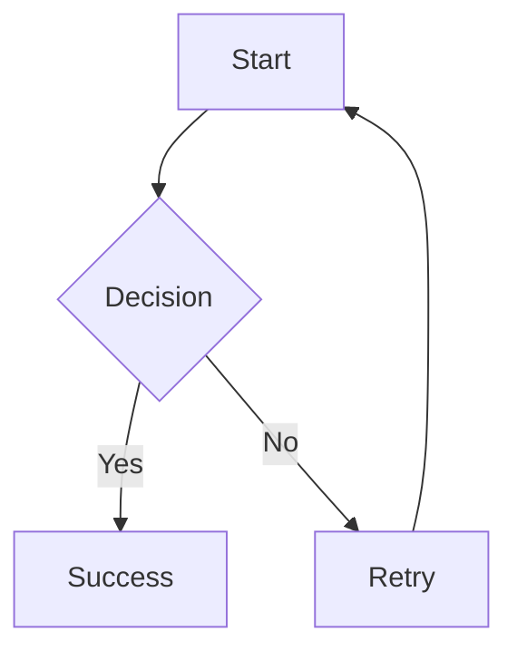
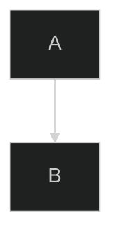

# CLAUDE.md

This file provides guidance to Claude Code (claude.ai/code) when working with code in this repository.

## Project Overview

This is **astro-marp**, a standalone Astro integration plugin that transforms `.marp` Markdown slide sources into optimized presentation pages. The integration leverages Astro's full build and dev lifecycle (routing, content collections, asset optimization) to make slide decks feel native to Astro projects.

## Architecture

The plugin follows the **astro-typst pattern** for deep Astro integration:

### Core Integration Structure
- **Main Integration** (`src/index.ts`): Exports the `marp()` function that registers with Astro's `astro:config:setup` hook
- **Renderer Registration**: Uses `addRenderer()` to register the Marp component renderer (enables src/pages/ routing)
- **Page Extension**: Uses `addPageExtension('.marp')` to register `.marp` files as routable pages
- **Content Collections**: Uses `addContentEntryType()` to make `.marp` files queryable via Astro's content APIs
- **Vite Plugin**: Custom Vite plugin for transforming `.marp` files into virtual modules

### Virtual Module System
Each `.marp` file is transformed into a virtual module (`virtual:astro-marp/<slug>`) that exports:
```typescript
export const html: string;              // Marp-rendered HTML fragment
export const meta: {                    // Presentation metadata
  id, slug, title, theme, slidesCount,
  updatedAt, sourceHash, images, frontmatter
};
export const raw: string;               // Post-processed Markdown
```

### Transformation Pipeline
1. **Parse** `.marp` file and extract frontmatter
2. **Image Processing**: Collect local image references and replace paths with placeholders
   - **Critical**: Keep Markdown syntax intact to preserve Marp directives
   - Example: `` → ``
   - This preserves directives like `height:`, `width:`, `bg`, etc.
3. **Mermaid Preprocessing**: Convert fenced code blocks to HTML code blocks
   - Example: ` ```mermaid\ngraph TD\n  A --> B\n``` ` → `<pre><code class="language-mermaid">graph TD\n  A --> B</code></pre>`
   - This format is required by rehype-mermaid for server-side rendering
   - Enabled by default unless `enableMermaid: false`
   - Happens AFTER image processing, BEFORE Marp CLI
4. **Marp CLI Execution**: Pipe processed Markdown to `marp --stdin --theme <path> -o -`
   - Marp CLI processes directives: `` → ``
   - Preserves HTML: `<pre><code class="language-mermaid">` tags pass through with `--html` flag
5. **Mermaid Server-Side Rendering** (if `enableMermaid !== false`):
   - Apply rehype-mermaid plugin to convert `<code class="language-mermaid">` to SVG/PNG at build time
   - Uses unified/rehype pipeline for HTML AST processing
   - Output format controlled by `mermaidStrategy` option
6. **Image Optimization**: Process images via Astro's `getImage()` and replace placeholders in HTML
   - Final: `` → ``
7. **Module Generation**: Create virtual module with rendered HTML + metadata
8. **Content Collection**: Register entry for querying via `getCollection()`

### Key Components
- **Vite Plugin** (`src/lib/vite-plugin-marp.ts`): Handles file transformation and virtual module creation
- **Theme System** (`src/themes/`, `src/lib/theme-resolver.ts`): Dynamic theme discovery and built-in SCSS themes passed to Marp CLI via `--theme` flag
- **Image Processor**: Local image optimization through Astro's asset pipeline
- **Content Entry Type**: Integration with Astro's content collection system

### Mode Detection (Dev vs Build)

**Pattern Alignment**: Following official Astro integrations (MDX, Markdoc)

The integration uses Astro's `command` parameter from the `astro:config:setup` hook to detect the current mode, **not** Vite's `configResolved` hook:

```typescript
// src/index.ts
'astro:config:setup': (options) => {
  const { command, updateConfig, logger } = options;
  // command is 'dev' | 'build' | 'preview'
  updateConfig({
    vite: {
      plugins: [createViteMarpPlugin(config, command, logger)],
    },
  });
}

// src/lib/vite-plugin-marp.ts
export function createViteMarpPlugin(
  config: MarpConfig,
  command: 'dev' | 'build' | 'preview',
  logger?: any
): Plugin {
  const isBuild = command === 'build';
  // Use isBuild throughout the plugin
}
```

**Why This Matters**:
1. ✅ **Aligns with official patterns**: MDX and Markdoc use the same approach
2. ✅ **More reliable**: Uses Astro's lifecycle instead of Vite's
3. ✅ **Simpler code**: No need for `configResolved` hook
4. ✅ **Future-proof**: Less dependent on Vite internals

**Mode-Specific Behavior**:
- **Dev mode** (`command === 'dev'`): Uses `/@fs` URLs for images with metadata query params
- **Build mode** (`command === 'build'`): Uses `emitFile()` for optimized assets with content hashing
- **Transformation pipeline**: Consistent across all modes (no different error handling)

## Configuration

The integration supports the following configuration options:
```javascript
// astro.config.mjs
import { defineConfig } from 'astro/config';
import { marp } from 'astro-marp';

export default defineConfig({
  integrations: [
    marp({
      defaultTheme: 'am_blue',           // Built-in theme name
      enableMermaid: true,               // Enable Mermaid diagram support (default: true)
      mermaidStrategy: 'inline-svg',     // Server-side rendering strategy (default: 'inline-svg')
      debug: false,                      // Enable debug logging (default: false)
      maxSlides: undefined,              // Maximum number of slides to process (optional)
    })
  ]
});
```

### Mermaid Rendering Strategies (Server-Side Only)

All Mermaid diagrams are rendered at build time using rehype-mermaid. The `mermaidStrategy` option controls the output format:

- **`'inline-svg'` (default)**: Build-time rendering as inline SVG
  - ✅ Diagrams pre-rendered at build time
  - ✅ No client-side JavaScript required
  - ✅ Best for static hosting
  - ✅ Fastest page load (no separate requests)

- **`'img-svg'`**: Build-time rendering as SVG images
  - ✅ Diagrams pre-rendered as separate SVG files
  - ✅ Can be cached by browser
  - ✅ Good for presentations with many diagrams

- **`'img-png'`**: Build-time rendering as PNG images
  - ✅ Diagrams pre-rendered as PNG files
  - ✅ Maximum compatibility
  - ⚠️ Larger file sizes than SVG

- **`'pre-mermaid'`**: Output as `<pre class="mermaid">` for custom rendering
  - For advanced use cases with custom Mermaid initialization

**Installation Requirements**:
Playwright is required for server-side Mermaid rendering:
```bash
npm install playwright
npx playwright install chromium
```

## Development Workflow

### File Structure - Dual-Mode Support

**Option 1: src/pages/ Routing (Direct Page Access)**
- Place `.marp` files in `src/pages/` directory
- Files become directly accessible routes (e.g., `src/pages/demo.marp` → `/demo`)
- Works exactly like `.mdx` or `.astro` files
- Ideal for standalone presentations

**Option 2: Content Collections (Programmatic Access)**
- Place `.marp` files in content collections (e.g., `src/content/presentations/`)
- Query via `getCollection('presentations')`
- Generate routes programmatically with `[...slug].astro`
- Ideal for presentation listings, archives, or dynamic routing

**Both modes work simultaneously** - you can mix and match based on your needs.

### Asset Handling
- Local images are automatically optimized via Astro's pipeline
- Remote images pass through unchanged

### Key Features
- **HMR Support**: Changes to `.marp` files trigger automatic browser reload
  - **Critical Component**: `maybeRenderHead(result)` injects Vite HMR client script
  - **Pattern Source**: Matches Astro's Markdown HMR implementation (Issue #8378, PR #8418)
  - **Technical**: Uses `configureServer` file watcher + simplified `handleHotUpdate` hook
  - **Result**: Browser auto-reloads instantly without manual refresh
- **Marp Image Directives**: Full support for Marp's image syntax with Astro optimization
  - **Size directives**: ``, ``
  - **Background images**: ``, ``, ``
  - **Filters**: ``, ``
  - **Implementation**: Preserves Markdown syntax until after Marp CLI processing
  - **Result**: Directives convert to proper styles while images are optimized
- **Content Collections**: Query presentations via `getCollection('presentations')`
- **Asset Optimization**: Local images processed through Astro's optimization
- **Dynamic Theme System**: Automatic discovery of available themes from filesystem, no hardcoded lists
- **Mermaid Diagram Support**: Standard ```mermaid fenced code block syntax with server-side rendering
  - **Syntax**: Use standard Markdown fenced code blocks with `mermaid` language
  - **Processing**: Converts ` ```mermaid` to `<div class="mermaid">` before Marp CLI
  - **Rendering**: Server-side pre-rendering via rehype-mermaid at build time
  - **Output Formats**: Choose between inline SVG, SVG images, or PNG images
  - **Configuration**: Enabled by default, configurable with `mermaidStrategy` option
  - **Matching Astro Experience**: Uses rehype-mermaid, same as Astro's markdown
  - **Requirements**: Playwright installation required

## Mermaid Diagrams

### Usage

Write Mermaid diagrams using standard fenced code block syntax:

````markdown

````

### Processing Pipeline

```
User writes: ```mermaid ... ```
↓
astro-marp preprocesses: <pre><code class="language-mermaid">...</code></pre>
↓
Marp CLI processes (passes HTML through with --html flag)
↓
rehype-mermaid renders at build time
↓
┌─────────────────────────────────────────────────┐
│  Output format based on mermaidStrategy:       │
├─────────────────────────────────────────────────┤
│  'inline-svg' (default):                       │
│    → Diagram embedded as inline SVG            │
│    → No separate file, fastest load            │
│                                                 │
│  'img-svg':                                    │
│    → Diagram saved as separate SVG file        │
│    → Cacheable by browser                      │
│                                                 │
│  'img-png':                                    │
│    → Diagram saved as separate PNG file        │
│    → Maximum compatibility                     │
└─────────────────────────────────────────────────┘
↓
Static HTML with pre-rendered diagrams
```

### Configuration

Mermaid support is **enabled by default** with server-side rendering. You can configure the output format:

```javascript
// astro.config.mjs
export default defineConfig({
  integrations: [
    marp({
      defaultTheme: 'am_blue',
      enableMermaid: true,           // Enable/disable Mermaid (default: true)
      mermaidStrategy: 'inline-svg', // Output format (default: 'inline-svg')
    })
  ]
});
```

**Available strategies**:
- `'inline-svg'`: Default, inline SVG embedding
- `'img-svg'`: Separate SVG image files
- `'img-png'`: Separate PNG image files
- `'pre-mermaid'`: Custom rendering (advanced)

See the [Mermaid Rendering Strategies](#mermaid-rendering-strategies-server-side-only) section for detailed comparison.

### Supported Diagram Types

All Mermaid diagram types are supported:
- **Flowcharts**: `graph TD`, `graph LR`
- **Sequence Diagrams**: `sequenceDiagram`
- **Class Diagrams**: `classDiagram`
- **State Diagrams**: `stateDiagram`
- **ER Diagrams**: `erDiagram`
- **Gantt Charts**: `gantt`
- **Pie Charts**: `pie`
- **Git Graphs**: `gitGraph`
- **User Journey**: `journey`
- **Block Diagrams**: `block-beta` (Mermaid 11+)

### Customizing Mermaid Appearance

Use Mermaid's initialization directives within your diagram code:

````markdown

````

### Debug Mode

Enable debug logging to see Mermaid conversion in action:

```javascript
// astro.config.mjs
marp({ defaultTheme: 'am_blue', debug: true })
```

Console output will show:
```
[astro-marp] Converted Mermaid fenced code blocks to HTML divs
```

### Technical Implementation

**Location:** `src/lib/vite-plugin-marp.ts` (lines 202-227, 301-310)

**Processing Flow:**
1. **Parse frontmatter** and extract .marp content
2. **Process images** for optimization (replace paths with placeholders)
3. **Convert Mermaid blocks** from ` ```mermaid` to `<div class="mermaid">`
4. **Marp CLI execution** (processes markdown, preserves HTML)
5. **Mermaid.js injection** (in marp-runner.ts) for client-side rendering

**Why This Works:**
- Marp CLI's `--html` flag preserves `<div class="mermaid">` tags
- Mermaid.js script automatically renders all elements with class="mermaid"
- Standard syntax matches Astro's markdown experience

### Future Enhancement: Build-Time Rendering

**Current**: Client-side rendering (requires JavaScript in browser)
**Future**: Optional build-time SVG generation using rehype-mermaid plugin

This would:
- Render diagrams at build time (no client-side JS needed)
- Improve SEO and performance
- Require Playwright dependency (~300MB)

## Testing Strategy

### Manual Testing
The plugin includes a comprehensive manual testing protocol using a parent test-astro-project:
1. Install integration in test project with `src/content/presentations/` collection
2. Verify route accessibility (`/presentations/macroeconomics`)
3. Browser console validation (no errors/warnings)
4. Slide navigation testing with arrow keys
5. HMR validation on file changes
6. Image optimization verification

### Automated Testing
- Playwright/Chrome DevTools MCP tools for browser automation
- Console log capture and analysis
- Process management verification (clean shutdown)

## Current Implementation Status

### ✅ COMPLETED (90%)
- **Core Integration**: Full Astro lifecycle integration
- **Image Optimization**: Local images → `dist/_astro/` with hashing
- **Content Collections**: Complete `getCollection('presentations')` support
- **Build Pipeline**: Clean builds without Vite conflicts
- **Dynamic Theme System**: Automatic theme discovery from filesystem (6 built-in themes: am_blue, am_brown, am_dark, am_green, am_purple, am_red)
- **Virtual Modules**: Proper `virtual:astro-marp/<slug>` pattern
- **Error Handling**: Graceful failure with error components

### 🔄 PENDING (5%)
- **Custom Themes**: User-provided SCSS themes (temporarily disabled)
- **Advanced Features**: Enhanced navigation controls, presenter mode customization

### ✅ RESOLVED: Page Routing Implementation
**Previous Issue**: Page routing was partially implemented with `addPageExtension()` but missing `addRenderer()`.

**Solution**: Added renderer registration following MDX/Markdown pattern:
```typescript
addRenderer({
  name: 'astro:jsx',
  serverEntrypoint: new URL('../dist/renderer/index.js', import.meta.url),
});
addPageExtension('.marp');
```

**Result**: `.marp` files now work in both `src/pages/` (direct routing) and `src/content/` (collections) simultaneously.

## Dependencies

- **Core**: `@marp-team/marp-cli` (direct dependency, not npx)
- **Astro APIs**: `addContentEntryType`, `addRenderer`, Vite plugin system
- **Image Processing**: Astro's native asset pipeline with runtime template replacement
- **Themes**: Dynamic theme discovery from `/src/themes/` directory with built-in SCSS files

## Security Considerations

- Only local file theme references allowed (under approved directories)
- Remote theme URLs disabled in MVP
- Filesystem reads restricted to project root and allowed alias directories
- No remote image fetching (keeps builds deterministic)

## Known Issues & Workarounds

### ✅ RESOLVED: Mode Detection Using Vite Instead of Astro
**Previous Issue**: Used Vite's `configResolved` hook for mode detection instead of Astro's `command` parameter
**Resolution**: Updated to use `command` parameter from `astro:config:setup` hook, following official Astro integration patterns (MDX, Markdoc)
**Changed Files**: `src/index.ts`, `src/lib/vite-plugin-marp.ts`
**Benefits**: More reliable, simpler code, better alignment with Astro ecosystem

### ✅ RESOLVED: Page Routing Disabled
**Previous Issue**: Direct `.marp` page routing was partially implemented but not working
**Root Cause**: Had `addPageExtension()` but missing `addRenderer()` call
**Resolution**: Added renderer registration in `astro:config:setup` hook
**Result**: `.marp` files now work in both `src/pages/` and `src/content/` directories

### 1. Custom Themes Disabled
**Issue**: Custom themes cause CSS import errors in Marp CLI
**Workaround**: Use built-in themes (am_blue, am_brown, am_dark, am_green, am_purple, am_red)
**Fix Needed**: Enhanced theme path resolution and Marp CLI integration

### 3. Test Project Warning
**Issue**: `Unsupported file type test.marp found` warning in build
**Impact**: Cosmetic only, doesn't affect functionality
**Workaround**: Prefix with underscore: `_test.marp` to ignore

### 4. Astro Internal Import Warning (Cosmetic)
**Issue**: Vite warning about unused imports in Astro 5.14.x internal files: `"matchHostname", "matchPathname", "matchPort" and "matchProtocol" are imported from external module "@astrojs/internal-helpers/remote" but never used`
**Source**: Astro's internal asset handling modules (`remotePattern.js`, `service.js`)
**Impact**: Cosmetic only - Vite tree-shaking warning, doesn't affect functionality
**Cause**: Unused imports in Astro's own code, not caused by astro-marp integration
**Workaround**: Can be safely ignored; will likely be fixed in future Astro releases

## Debug Information

### Successful Build Indicators
```
✅ [astro-marp] Discovered 6 themes: am_blue, am_brown, am_dark, am_green, am_purple, am_red
✅ [astro-marp] Processing local image: ./images/business-cycle.svg -> import image0
✅ dist/_astro/business-cycle.Cz_Ut2UY.svg (optimized asset created)
✅  (correct URL in HTML)
✅ Build completes without Vite import analysis errors
```

### Common Issues
```
❌ TypeError: Cannot read property 'src' of undefined
   → Image import statement malformed, check generated component code

❌ Vite import analysis error on .marp files
   → Page extension conflict, ensure addPageExtension is disabled

❌ Images showing as ${image0.src} in output
   → Template literal replacement not working, check runtime replacement logic

❌ Browser not auto-reloading when .marp files change
   → Missing maybeRenderHead(result) call - Vite HMR client script not injected
   → Check component generation includes: return render`${maybeRenderHead(result)}${unescapeHTML(html)}`;
```

## HMR Technical Implementation

### Critical Pattern (Issue #8378 Solution)

The integration uses the exact same HMR pattern as Astro's Markdown files:

```typescript
// Component generation (src/lib/vite-plugin-marp.ts:296, 332)
import { createComponent, render, maybeRenderHead, unescapeHTML } from "astro/runtime/server/index.js";

export const Content = createComponent(async (result, _props, slots) => {
    // Image optimization...
    let processedHtml = compiledContent();
    // Image placeholder replacement...

    // ✅ CRITICAL: Inject Vite HMR client script
    return render`${maybeRenderHead(result)}${unescapeHTML(processedHtml)}`;
});
```

### Why `maybeRenderHead` is Required

**What it does:**
- Injects `<script type="module" src="/@vite/client"></script>` in dev mode
- This script connects browser to Vite's WebSocket server
- Browser receives HMR update messages and auto-reloads

**Without it:**
- File changes are detected ✅
- Modules are invalidated ✅
- Transform pipeline runs ✅
- Browser doesn't reload ❌ (no HMR client script)

### HMR Hook Implementation

```typescript
// File watcher (src/lib/vite-plugin-marp.ts:224-247)
configureServer(viteServer) {
  if (isBuild) return;

  viteServer.watcher.on('change', (file) => {
    if (!isMarpFile(file)) return;

    const modules = viteServer.moduleGraph.getModulesByFile(file);
    if (modules) {
      for (const mod of modules) {
        viteServer.moduleGraph.invalidateModule(mod);
      }
    }
  });
}

// HMR handler (src/lib/vite-plugin-marp.ts:398-416)
async handleHotUpdate(ctx) {
  const { file } = ctx;
  if (!isMarpFile(file)) return;

  // Let Vite handle module invalidation automatically
  // Following modern Astro pattern (PR #9706)
  return undefined;
}
```

### Pattern Comparison

| Approach | Markdown (.md) | astro-marp (.marp) |
|----------|---------------|-------------------|
| Vite Client Injection | `maybeRenderHead` | `maybeRenderHead` ✅ |
| File Watcher | Built-in | `configureServer` ✅ |
| HMR Handler | None (Vite default) | Simplified (returns `undefined`) ✅ |
| Result | Auto-reload ✅ | Auto-reload ✅ |

### Debugging HMR

**Enable debug mode:**
```javascript
// astro.config.mjs
marp({ defaultTheme: 'am_blue', debug: true })
```

**Expected console output:**
```
[astro-marp] File watcher detected change: /path/to/file.marp
[astro-marp] Invalidated X module(s) from watcher
[astro-marp] HMR triggered for: /path/to/file.marp
```

**Browser console should show:**
```
[vite] connected
[vite] hot updated: /path/to/file.marp
```

**Check for Vite client script:**
```bash
# View page source in dev mode
# Should see: <script type="module" src="/@vite/client"></script>
```

## Maintenance Notes

### When Updating Dependencies
1. **Astro Updates**: Check for API changes in `addContentEntryType` and Vite plugin interfaces
2. **Marp CLI Updates**: Verify theme loading and HTML output format compatibility
3. **Vite Updates**: Test that plugin ordering and transformation pipeline still works

### Performance Monitoring
- Watch for increased build times with large numbers of presentations
- Monitor memory usage during image optimization
- Check that template literal replacement doesn't cause runtime performance issues

This integration represents a successful implementation of the astro-typst pattern with significant enhancements for image optimization and asset pipeline integration.