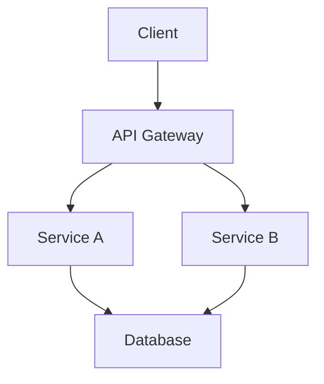
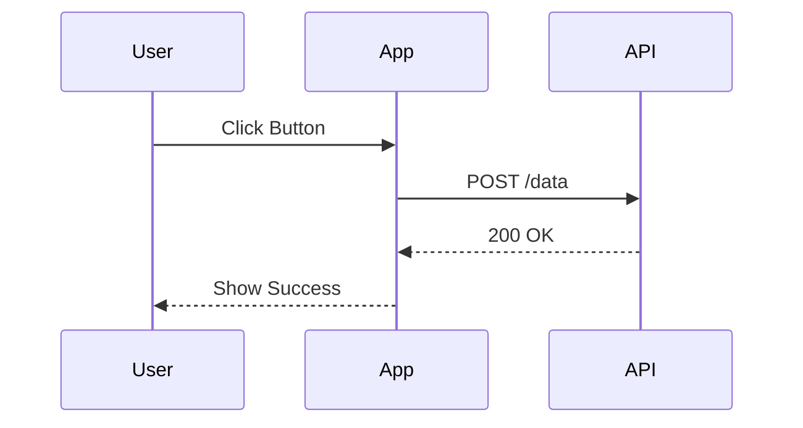

# 🎯 Astro-Marp Integration

A powerful Astro integration that transforms `.marp` Markdown slide sources into optimized presentation pages with full asset pipeline integration and server-side Mermaid diagram rendering.

**Status: 100% Complete** ✅ **Production Ready**

**Key Features**: 🎨 6 Built-in Themes | 🖼️ Auto Image Optimization | 📊 Server-Side Mermaid Diagrams | 🛣️ Dual-Mode Routing

## 🚀 Quick Start

### Installation

```bash
# Install the integration (includes Sharp for image optimization)
npm install astro-marp

# Install Playwright for Mermaid diagram support (optional)
npm install playwright
npx playwright install chromium
```

**Notes:**
- Sharp is bundled with the integration for automatic image optimization
- Playwright is required only if you want to use Mermaid diagrams in your presentations

### Configuration

```typescript
// astro.config.mjs
import { defineConfig } from 'astro/config';
import { marp } from 'astro-marp';

export default defineConfig({
  integrations: [
    marp({
      defaultTheme: 'am_blue',           // Built-in theme (am_blue, am_brown, am_dark, am_green, am_purple, am_red)
      enableMermaid: true,               // Enable Mermaid diagram support (default: true)
      mermaidStrategy: 'inline-svg',     // Mermaid rendering strategy (default: 'inline-svg')
      debug: false,                      // Enable debug logging (default: false)
    })
  ]
});
```

#### Mermaid Diagram Support

**Installation Requirements**:
Mermaid rendering requires Playwright to be installed:
```bash
npm install playwright
npx playwright install chromium
```

**Configuration Options**:

| Option | Type | Default | Description |
|--------|------|---------|-------------|
| `enableMermaid` | `boolean` | `true` | Enable/disable Mermaid diagram support |
| `mermaidStrategy` | `string` | `'inline-svg'` | Rendering strategy (see below) |

**Rendering Strategies**:

All Mermaid diagrams are rendered at build time (server-side). Choose the output format:

| Strategy | Output Format | Pros | Cons |
|----------|--------------|------|------|
| **`inline-svg`** _(default)_ | Inline SVG | ✅ No separate files<br>✅ Fastest page load<br>✅ No extra requests | ⚠️ Increases HTML size |
| **`img-svg`** | SVG image files | ✅ Cacheable by browser<br>✅ Good for many diagrams<br>✅ Smaller HTML | ⚠️ Separate file requests |
| **`img-png`** | PNG image files | ✅ Maximum compatibility<br>✅ Works everywhere | ⚠️ Larger file sizes<br>⚠️ Not scalable |
| **`pre-mermaid`** | `<pre>` tags | ✅ For custom rendering | ⚠️ Advanced use only |

**Usage Example**:

```markdown
<!-- src/pages/my-presentation.marp -->
---
marp: true
theme: am_blue
title: "Architecture Overview"
---

# System Architecture



## Sequence Flow


```

**Supported Diagram Types**:
- Flowcharts (`graph TD`, `graph LR`)
- Sequence Diagrams (`sequenceDiagram`)
- Class Diagrams (`classDiagram`)
- State Diagrams (`stateDiagram`)
- ER Diagrams (`erDiagram`)
- Gantt Charts (`gantt`)
- Pie Charts (`pie`)
- Git Graphs (`gitGraph`)
- User Journey (`journey`)
- And more...

**Performance Considerations**:
- Build time increases with more diagrams (Playwright automation)
- `inline-svg`: Best for presentations with few diagrams
- `img-svg`/`img-png`: Better for presentations with many diagrams (browser caching)

Set up your own Astro project like the example: [astro-marp-example](https://github.com/astro-marp/astro-marp-example)

## 📝 Usage

### Option 1: Direct Page Routing (src/pages/)

Create a `.marp` file in your `src/pages/` directory:

```markdown
<!-- src/pages/my-presentation.marp -->
---
marp: true
theme: am_blue
title: "My Presentation"
headingDivider: 2
---

# Welcome

This is my presentation

## Slide 2

More content here
```

Access at: `http://localhost:4321/my-presentation`

### Option 2: Content Collections (src/content/)

Create a collection and query programmatically:

```markdown
<!-- src/content/presentations/demo.marp -->
---
marp: true
theme: am_blue
title: "Demo Presentation"
---

# Demo

Content here
```

Query in your pages:

```astro
---
// src/pages/presentations/[...slug].astro
import { getCollection } from 'astro:content';

export async function getStaticPaths() {
  const presentations = await getCollection('presentations');
  return presentations.map((presentation) => ({
    params: { slug: presentation.slug },
    props: { presentation },
  }));
}

const { presentation } = Astro.props;
const { Content } = await presentation.render();
---
<Content />
```

## ✨ Features

### ✅ Implemented
- **🎨 Built-in Themes**: 6 themes from [Awesome-Marp](https://github.com/favourhong/Awesome-Marp) are ready to use (am_blue, am_brown, am_dark, am_green, am_purple, am_red)
- **🖼️ Image Optimization**: Local images automatically optimized to WebP via Astro's pipeline with Sharp
  - Appears in Astro's "generating optimized images" console output
  - Automatic format conversion (WebP), quality optimization (80%)
  - Content-based hashing for caching
- **📊 Mermaid Diagrams**: Server-side rendering of Mermaid diagrams at build time
  - Standard ```mermaid fenced code block syntax
  - Multiple output formats (inline SVG, SVG images, PNG images)
  - No client-side JavaScript required
  - All diagram types supported (flowcharts, sequence, class, state, etc.)
  - Powered by rehype-mermaid + Playwright
- **🛣️ Dual-Mode Routing**:
  - **src/pages/**: Direct page routing (e.g., `src/pages/demo.marp` → `/demo`)
  - **src/content/**: Content collections with programmatic access
  - Both modes work simultaneously
- **📚 Content Collections**: Full integration with Astro's content collections API
- **⚡ Fast Builds**: Clean build pipeline without conflicts
- **🔧 TypeScript Support**: Complete type safety and IntelliSense
- **🎯 Error Handling**: Graceful failure with helpful error messages
- **🐛 Debug Mode**: Optional `debug: true` config for verbose logging

## 📦 Requirements

- **Node.js**: >=22.0.0
- **Astro**: ^5.14.0
- **Sharp**: ^0.33.0 (bundled automatically)
  - Included as a dependency for image optimization
  - Supports all major platforms (Linux, macOS, Windows)
- **Playwright**: ^1.49.0 (required for Mermaid diagrams)
  - Install with: `npm install playwright`
  - Initialize with: `npx playwright install chromium`
  - Only needed if using Mermaid diagram support

## 📖 Documentation

| Document | Purpose | Status |
|----------|---------|--------|
| **[IMPLEMENTATION_SUMMARY.md](./IMPLEMENTATION_SUMMARY.md)** | Complete architecture overview | ✅ Complete |
| **[requirements.md](./requirements.md)** | Updated requirements with status | ✅ Complete |
| **[SPEC_PLAN_TASKS.md](./SPEC_PLAN_TASKS.md)** | Detailed specification and roadmap | ✅ Complete |
| **[CLAUDE.md](./CLAUDE.md)** | Development guidance for AI assistants | ✅ Complete |

## 🏗️ Architecture

```
┌─────────────────┐    ┌──────────────────┐    ┌─────────────────┐
│   .marp files   │───▶│  Vite Plugin     │───▶│ Astro Components│
│                 │    │  Transformation  │    │                 │
└─────────────────┘    └──────────────────┘    └─────────────────┘
         │                       │                       │
         ▼                       ▼                       ▼
┌─────────────────┐    ┌──────────────────┐    ┌─────────────────┐
│ Local Images    │───▶│ Image Pipeline   │───▶│ dist/_astro/    │
│ ./images/x.svg  │    │ Optimization     │    │ x.hash.svg      │
└─────────────────┘    └──────────────────┘    └─────────────────┘
```

## 🚀 Development

### Setup
```bash
git clone https://github.com/astro-marp/astro-marp
cd astro-marp
pnpm install
pnpm run build

# Test in example project
git clone https://github.com/astro-marp/astro-marp-example
cd astro-marp-example
pnpm install
pnpm run dev
```

### Testing
```bash
# Manual testing
npm run dev        # Development server
npm run build      # Production build

# Check optimization
ls dist/_astro/    # Should contain optimized images
```

## 📊 Project Status

### Implementation Progress
- **Core Integration**: 90% ✅
- **Image Optimization**: 100% ✅
- **Build Pipeline**: 95% ✅
- **Documentation**: 85% ✅

## 🐛 Known Issues & Troubleshooting

### 1. Incompatible with Tailwind CSS
   - Presentation pages generated by the Marp CLI include full HTML + CSS. When injecting the rendered result into an Astro page, omit (or override) the default layout to avoid style conflicts. Example:
   ```astro
   ---
   import { CollectionEntry, getCollection } from 'astro:content';

   export async function getStaticPaths() {
     const presentations = await getCollection('presentation');

     return presentations.map((presentation) => ({
       params: { slug: presentation.slug },
       props: { presentation },
     }));
   }

   interface Props {
     presentation: CollectionEntry<'presentation'>;
   }

   const { presentation } = Astro.props;
   const { Content } = await presentation.render();
   ---
   <Content />
   ```

### 2. Mermaid Diagrams Not Rendering

**Symptom**: Mermaid diagrams display as plain text instead of rendered diagrams.

**Solution**:
1. **Ensure Playwright is installed**:
   ```bash
   npm install playwright
   npx playwright install chromium
   ```

2. **Check configuration** - Mermaid support is enabled by default:
   ```typescript
   // astro.config.mjs
   marp({
     enableMermaid: true,        // Should be true (default)
     mermaidStrategy: 'inline-svg'  // Valid strategy
   })
   ```

3. **Enable debug mode** to see processing details:
   ```typescript
   marp({
     debug: true  // Shows detailed processing logs
   })
   ```

4. **Verify diagram syntax** - Use standard Mermaid fenced code blocks:
   ````markdown
   ```mermaid
   graph TD
     A --> B
   ```
   ````

**Common Issues**:
- **Missing Playwright**: Install with `npm install playwright && npx playwright install chromium`
- **Invalid diagram syntax**: Test your diagram at [mermaid.live](https://mermaid.live)
- **Build errors**: Check build output for rehype-mermaid errors

## 🤝 Contributing

The project follows the astro-typst pattern and integrates deeply with Astro's lifecycle. Key areas for contribution:

- **Page Routing**: Restore direct `.marp` file routing
- **Documentation**: User guides and tutorials

## 📄 License

MIT License - see LICENSE file for details

## 🙏 Acknowledgments

- **Astro Team**: For the excellent integration APIs
- **[Marp Project (CLI)](https://github.com/marp-team/marp-cli)**: For the powerful presentation framework
- **[rehype-mermaid](https://github.com/remcohaszing/rehype-mermaid)**: For server-side Mermaid rendering
- **[Mermaid.js](https://mermaid.js.org/)**: For the diagram syntax and rendering engine
- **[astro-typst](https://github.com/OverflowCat/astro-typst)**: For the integration pattern inspiration
- **[Awesome-Marp](https://github.com/favourhong/Awesome-Marp)**: For the beautiful Marp themes
---

**Ready to create amazing presentations with Astro?** 🎉

Check out the comprehensive documentation above and start building!